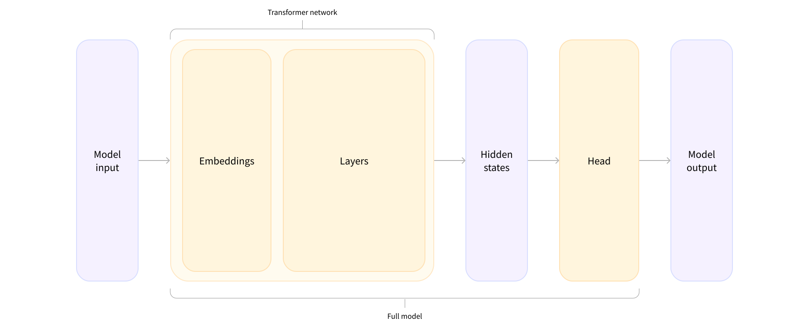

# AI/DL
## NLP Course - Hugging Face
### 2. Using Transformers
#### Introduction
Transformer 라이브러리 개발 취지: 여러 트랜스포머 모델을 간편하게 불러오고, 훈련하고, 저장할 수 있는 API 제공
- **Ease of use**: Hub에 공개된 NLP 모델을 단 두 줄의 코드로 사용 가능
- **Flexibility**: PyTorch `nn.Module` 혹은 TensorFlow `tf.keras.Model` 클래스로 제공
- **Simplicity**: "All in one file". 모델을 하나의 파일로 활용하기. 코드가 단순해지기도 하고 모델끼리 분리되기도 함
#### Behind the pipeline

##### Tokenizer: raw text를 자연어처리 모델이 다룰 수 있는 숫자로 바꾸는 역할 (토큰화)
- 텍스트 입력값을 단어, subwords, 기호 등 *토큰*으로 쪼갬
- 각각의 *토큰*을 어느 정수에 매핑
- 모델에 유용한 입력값 추가

`AutoTokenizer.from_pretrained('체크포인트명')`: 체크포인트로부터 tokenizer 인스턴스 생성
```python
from transformers import AutoTokenizer

# 체크포인트 명시
checkpoint = "distilbert-base-uncased-finetuned-sst-2-english"

# 위의 체크포인트로부터 tokenizer 호출
tokenizer = AutoTokenizer.from_pretrained(checkpoint)

# tokenizer에 투입할 입력값
raw_inputs = [
    "I've been waiting for a HuggingFace course my whole life.",
    "I hate this so much!",
]

# inputs: 텍스트 입력값을 토큰화한 결과 -> 추후 모델의 입력값으로 투입될 예정
inputs = tokenizer(raw_inputs, padding=True, truncation=True, return_tensors="pt")
print(inputs)
```
아래는 위의 `raw_inputs`의 토큰화된 버전
```
{
    'input_ids': tensor([
        [  101,  1045,  1005,  2310,  2042,  3403,  2005,  1037, 17662, 12172, 2607,  2026,  2878,  2166,  1012,   102],
        [  101,  1045,  5223,  2023,  2061,  2172,   999,   102,     0,     0,     0,     0,     0,     0,     0,     0]
    ]), 
    'attention_mask': tensor([
        [1, 1, 1, 1, 1, 1, 1, 1, 1, 1, 1, 1, 1, 1, 1, 1],
        [1, 1, 1, 1, 1, 1, 1, 1, 0, 0, 0, 0, 0, 0, 0, 0]
    ])
}
```
`input_ids`: 두 개의 정수 리스트를 담은 `tensor`. 각각 리스트는 `raw_inputs`의 문장과 대응하며, 각각의 정수는 `token`의 식별자임.
##### Model - `token` -> 고차원 벡터 -> head -> outputs
`AutoModel.from_pretrained('체크포인트명')`: `token` 입력을 받아서 특정한 예측 과정 수행하는 모델.
```python
from transformers import AutoModel

checkpoint = "distilbert-base-uncased-finetuned-sst-2-english"
model = AutoModel.from_pretrained(checkpoint)
```

예제의 모델은 주어진 `token`에 대해 *hidden states* (혹은 *features*) 반환하는 구조. 여기서 *hidden states*는 **고차원 벡터**의 형태로 표현함. input -> contextual understanding by the Transformer model

고차원 벡터의 형태를 구분짓는 3대 변수
- **Batch size**: 한 번에 처리되는 시퀀스의 수
- **Sequence length**: 시퀀스의 숫자 표현의 길이
- **Hidden size**: 모델 입력값의 벡터 차원 크기(768에서 큰 모델은 3,072 이상)
```python
outputs = model(**inputs)
print(outputs.last_hidden_state.shape)
# => torch.Size([2, 16, 768])
```

Model Heads

*Hidden states*를 입력값으로 받아서 다른 차원의 벡터로 반환하는 역할. 주로 한 개, 혹은 몇 개의 선형 레이어로 이루어짐. 언어와 맥락에 대한 추상적인 벡터로부터 모델을 통해 해결하고자 하는 문제에 적합한 형태로 변환하는 과정. 

아래는 Transformer 라이브러리가 제공하는 아키텍처 예시:
- *Model (retrieve the hidden states)
- *ForCausalLM
- *ForMaskedLM
- *ForMultipleChoice
- *ForQuestionAnswering
- *ForSequenceClassification
- *ForTokenClassification
- and others 🤗

문장분류 문제 예제
```python
from transformers import AutoModelForSequenceClassification

checkpoint = "distilbert-base-uncased-finetuned-sst-2-english"
model = AutoModelForSequenceClassification.from_pretrained(checkpoint)
outputs = model(**inputs)

print(outputs.logits.shape)
# => torch.Size([2, 2]) 2개의 문장과 2개의 label
```
##### Postprocessing the output
2x2 출력값의 정체는 *logits* 값
```python
print(outputs.logits)
# => tensor([[-1.5607,  1.6123],
#            [ 4.1692, -3.3464]], grad_fn=<AddmmBackward>)
```
*logits* 함수 값을 0에서 1사이의 확률 값으로 변환하려면 SoftMax 레이어에 통과시켜야 함
```python
import torch

predictions = torch.nn.functional.softmax(outputs.logits, dim=-1)
print(predictions)
# => tensor([[4.0195e-02, 9.5980e-01],
#            [9.9946e-01, 5.4418e-04]], grad_fn=<SoftmaxBackward>)
```
첫 번째 문장에 대한 결과값은 [.0402, .9598]로서 두 번째 label에 대해 95.98%의 확률 반환. 두 번째 문장에 대한 결과값은 [.9995, .0005]. 각 label 명칭을 확인하고자 한다면, `model.config.id2label` 조회해볼 것
```python
print(model.config.id2label)
# => {0: 'NEGATIVE', 1: 'POSITIVE'}
```

| 문장 | NEGATIVE(=0) | POSITIVE(=1) |
| ------ | ------ | ------ |
| (1) | .0402 | .9598 |
| (2) | .9995 | .0005 |
